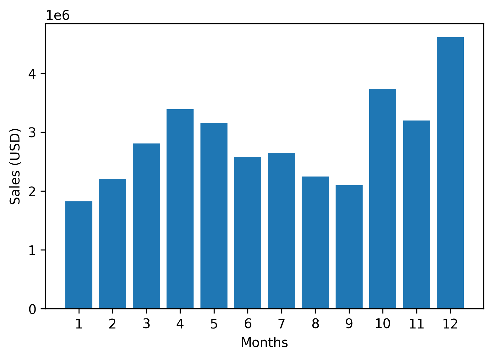
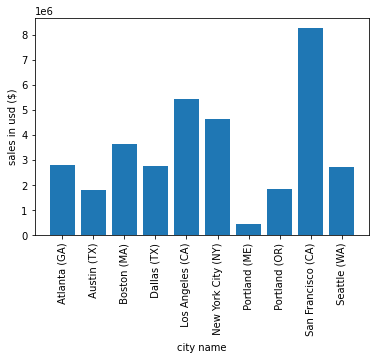
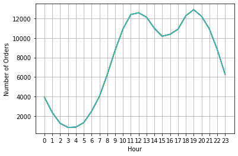

# Sales Data Analysis using Python

## About the Project

This project explores one year of electronics sales data using Python. I cleaned the data, performed exploratory data analysis (EDA), and created visualizations to identify sales trends and answer business-related questions.

## Tools Used

- Python
- Pandas
- NumPy
- Matplotlib
- Jupyter Notebook

## What I Analyzed

- Best month for sales
- Highest-performing city
- Peak hours for customer purchases
- Products frequently bought together
- Best-selling products

## Project Structure

```
Sales-Data-Analysis/
│
├── Sales_Project.ipynb
├── Sales_Data/
├── images/
├── README.md
└── requirements.txt
```

## How to Run

1. Install the required libraries:

```bash
pip install pandas numpy matplotlib
```
## Sample Visualizations

### Monthly Sales



### Sales by City



### Orders by Hour


## Author

**Mohd Arhab Ahmad**

MSc Statistics | Python | SQL | Power BI
